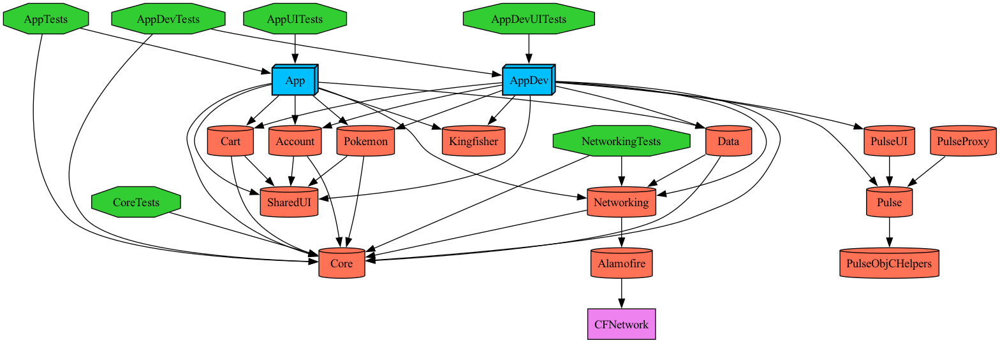

# ModularProjectSwiftUI

Reference iOS project exploring AI-assisted development — modular architecture, Swift 6 strict concurrency, declarative SwiftUI, and Tuist-based workspace generation. It is the SwiftUI counterpart of [ModularProject](../ModularProject), mirroring the same architecture and screens pixel-for-pixel with the idiomatic SwiftUI toolset.

---

## Tech stack

| | |
|---|---|
| **Language** | Swift 6 (`SWIFT_STRICT_CONCURRENCY = complete`) |
| **UI** | SwiftUI, fully declarative — no UIKit screens, no storyboards |
| **State** | Observation framework — `@Observable` stores, `@State` ownership |
| **Build system** | [Tuist 4](https://tuist.io) — workspace and project manifests as Swift code |
| **Networking** | Alamofire (static framework) with single-flight token refresh |
| **Image loading** | Kingfisher behind a `RemoteImageLoader` environment abstraction |
| **Logging** | OSLog in production · [Pulse](https://github.com/kean/Pulse) in the dev target |
| **Lint** | SwiftLint via SPM, per-target pre-build run script |
| **Linking** | Static by default for all modules and SPM dependencies |
| **Deployment target** | iOS 17.0 |

---

## Architecture

The project is structured around a strict dependency graph where each layer only knows about what is directly below it. No shortcuts, no circular imports.



### Module breakdown

```
ModularProjectSwiftUI/
├── App          → Composition root. Wires DI, owns the App entry point and TabView.
│                  Ships as two targets sharing the same sources:
│                  App (production) and AppDev (#if DEV — Pulse, debug tooling).
│
├── Core         → Foundation. Protocols, Sendable models, pure utilities.
│                  No SwiftUI. No networking. Depends on nothing.
│
├── Networking   → APIClient implementation (URLSession + Alamofire).
│                  Depends only on Core.
│
├── Data         → DTOs, repository implementations, domain mapping.
│                  Depends on Core and Networking.
│
├── SharedUI     → Reusable SwiftUI components consumed by all features.
│                  Depends on nothing — SwiftUI only.
│
└── Features/
    ├── Pokemon  → Pokémon list and detail, paginated, with image loading.
    ├── Account  → Registration, login, profile, session management.
    └── Cart     → Product listing and cart operations via FreeAPI.
```

### Dependency rules

Features depend only on `Core` and `SharedUI` — never on `Networking`, `Data`, or each other. `App` is the only layer allowed to instantiate concrete implementations and wire dependencies. This keeps features independently buildable, testable, and replaceable.

### Why this structure

- **Incremental builds**: Xcode only recompiles modules that actually changed. Touching a feature screen does not invalidate the networking layer.
- **Clear ownership**: where a piece of code lives tells you exactly what it is allowed to do. A file under `Data/` maps HTTP responses. A file under `Features/` owns one screen.
- **Testability by design**: `Core` protocols are the boundary. Unit tests mock at that boundary; no networking or UI knowledge leaks into logic tests.
- **Parallel work**: features are isolated enough that multiple developers (or agents) can work on them simultaneously without merge conflicts in shared files.

---

## Notable implementation details

### Swift 6 strict concurrency

The entire codebase compiles under `SWIFT_STRICT_CONCURRENCY = complete` and `SWIFT_APPROACHABLE_CONCURRENCY = YES` (Xcode 26). All public types crossing module boundaries are `Sendable`. Shared mutable state uses `actor` — no locks, no `DispatchQueue`, no `@unchecked Sendable`. `@MainActor` is reserved for types that are genuinely UI-bound.

### Observation-based stores

Each feature is driven by an `@Observable` store (`PokemonStore`, `AccountStore`, `CartStore`) owned by the view via `@State`. Views stay declarative and stateless; the store holds the view state enum and the `async` actions. This replaces the UIKit ViewModel + delegate/closure plumbing with a single observable source of truth.

### Environment-based dependency injection

SwiftUI's `EnvironmentValues` is the injection seam. Cross-cutting collaborators — the banner presenter (`\.bannerPresenter`) and the image loader (`\.remoteImageLoader`) — are provided once at the composition root and read with `@Environment` deep in the tree. No singletons leak into features.

### Kingfisher decoupling via `RemoteImageLoader`

`SharedUI` carries no third-party image dependency. It exposes a `RemoteImage` view backed by an injectable `RemoteImageLoader`; the concrete Kingfisher implementation lives only in `App` and is injected through `\.remoteImageLoader`. A native `AsyncImage` fallback renders previews and tests. This mirrors the UIKit `ImageLoader` protocol inversion and keeps `SharedUI` and the feature modules building in parallel with Kingfisher.

### Dual-target App / AppDev

Production (`App`) and development (`AppDev`) share the same sources and resources but compile separately. Anything that must never ship — Pulse network inspector, verbose log backends, shake-to-console — lives behind `#if DEV` and is only included in `AppDev`. One codebase, zero risk of debug tooling reaching production.

### Single-flight token refresh

When multiple requests 401 simultaneously, only one token refresh is issued. The others wait for the result. Implemented with `actor`-isolated state: no semaphores, no dispatch groups.

### Accessibility from day one

Dynamic Type at AX5, VoiceOver labels on all controls, Reduce Motion support on every animation, WCAG AA contrast on all custom color pairs. Accessibility is a hard build constraint enforced in every code review, not a polish step added at the end.

### Tuist `buildableFolders`

Source files are exposed via Xcode 16 synchronized root groups (`buildableFolders`). Adding or removing `.swift` files is picked up automatically on the next build — no `tuist generate` required for day-to-day work, only when manifests or dependencies change.

---

## Built with Claude Code

This project was developed with [Claude Code](https://claude.ai/code), Anthropic's AI coding tool, used throughout the entire lifecycle: architecture decisions, feature implementation, test writing, refactoring, and code review. It was built as a pixel-perfect SwiftUI port of the UIKit [ModularProject](../ModularProject), with the UIKit app acting as the source of truth for layout and behavior.

A key part of the workflow is encoding the project's conventions, constraints, and decisions as reusable context Claude Code reads before touching relevant code — so every change respects the established patterns without having to re-explain them each session.

### Conventions enforced

| Convention | Purpose |
|---|---|
| `repo-bootstrap` | Guides environment setup after cloning: mise → Tuist → SPM → workspace generation |
| `data-layer-conventions` | Enforces DTO-per-use-case split, domain mapping boundary, and repository structure under `Data/` |
| `feature-orchestration-conventions` | Decides when a feature should call a repository directly vs go through a session/handler facade |
| `shared-ui-reuse` | Prevents reinventing components, modifiers, or layout helpers already in `SharedUI` |
| `swiftui-state-management` | Keeps view state in `@Observable` stores and uses `@State`/`@Environment` ownership correctly |
| `swift-concurrency` | Diagnoses data races, guides `async/await` migration, enforces Swift 6 actor and `Sendable` patterns |
| `typography-and-text-accessibility` | Enforces Dynamic Type, VoiceOver labels, Reduce Motion, and contrast rules on every UI change |
| `ui-testing-conventions` | Covers the two UI test modes: fake-network accessibility audits and real-network use-case flows |
| `unit-testing-conventions` | Defines what deserves a unit test, how to wire test targets in Tuist, and Swift 6 mock patterns |
| `logger-conventions` | Enforces the `LogCenter` → `AppLogger` layering and keeps debug backends out of production |

These conventions act as a living contract between the developer and the AI: they capture the *why* behind each decision, so future sessions — human or AI — don't accidentally undo them.

---

## Getting started

```bash
# Install mise (if needed)
brew install mise

# Install pinned Tuist version
mise install

# Fetch SPM dependencies and generate workspace
tuist install
tuist generate

# Build
xcodebuild -workspace ModularProjectSwiftUI.xcworkspace \
  -scheme App \
  -destination 'generic/platform=iOS Simulator' \
  build
```
